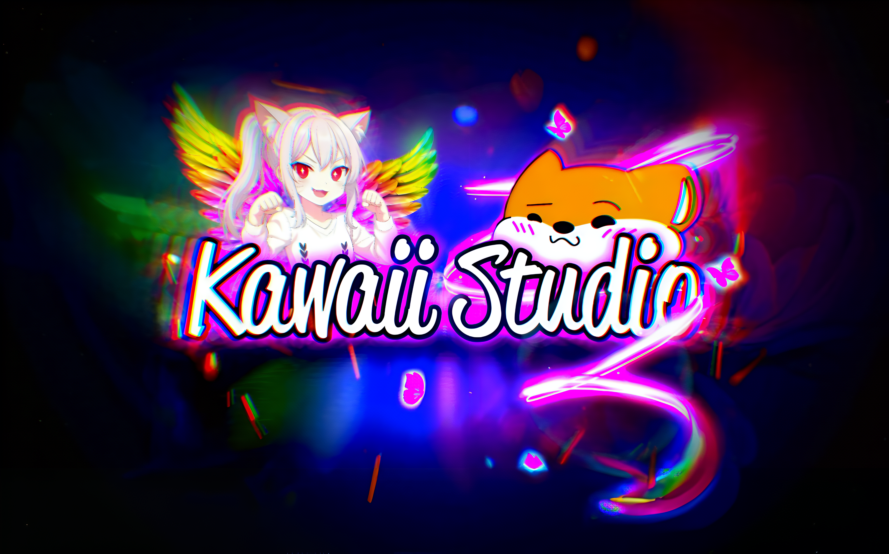
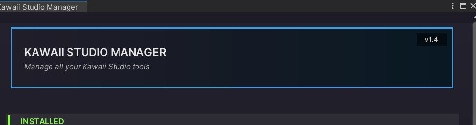
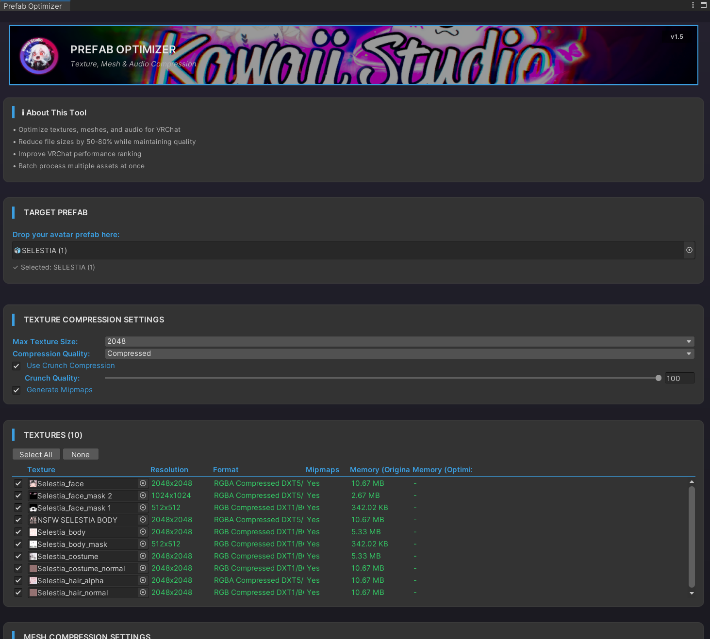
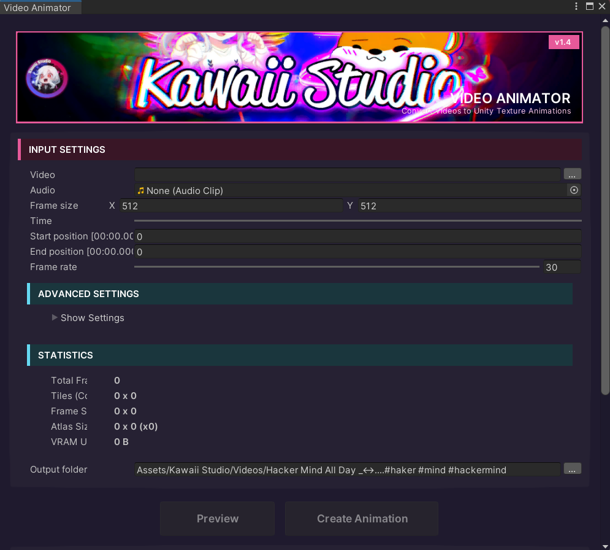
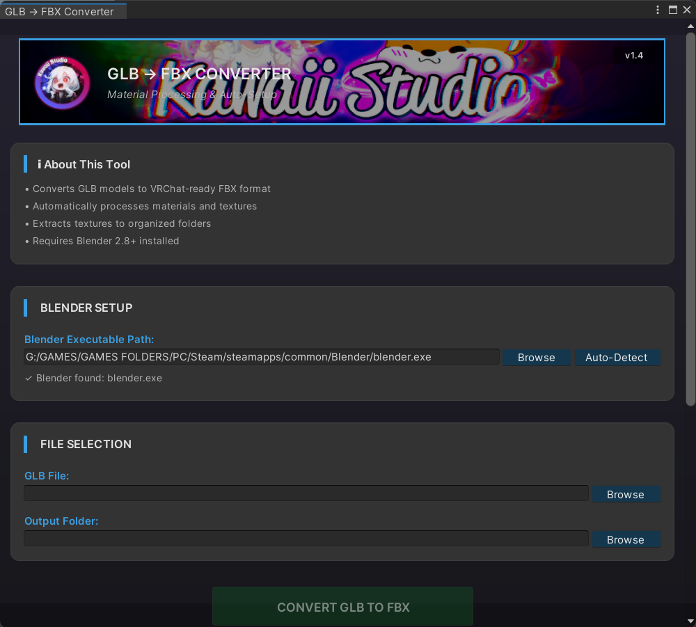
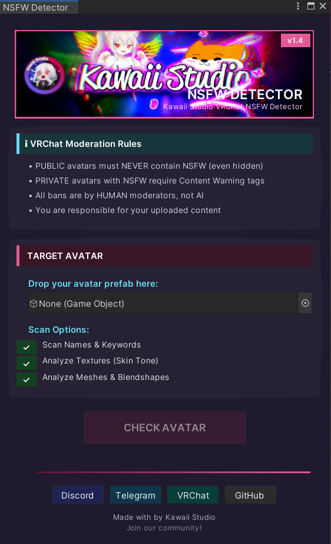
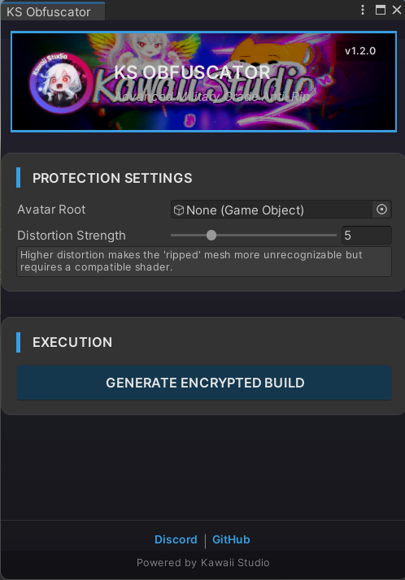
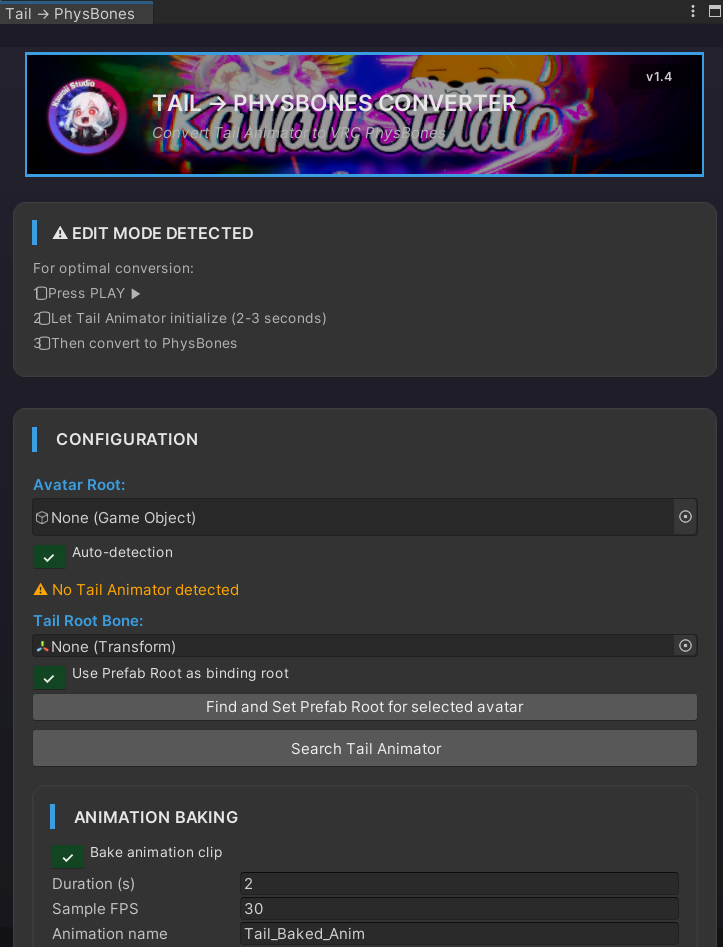
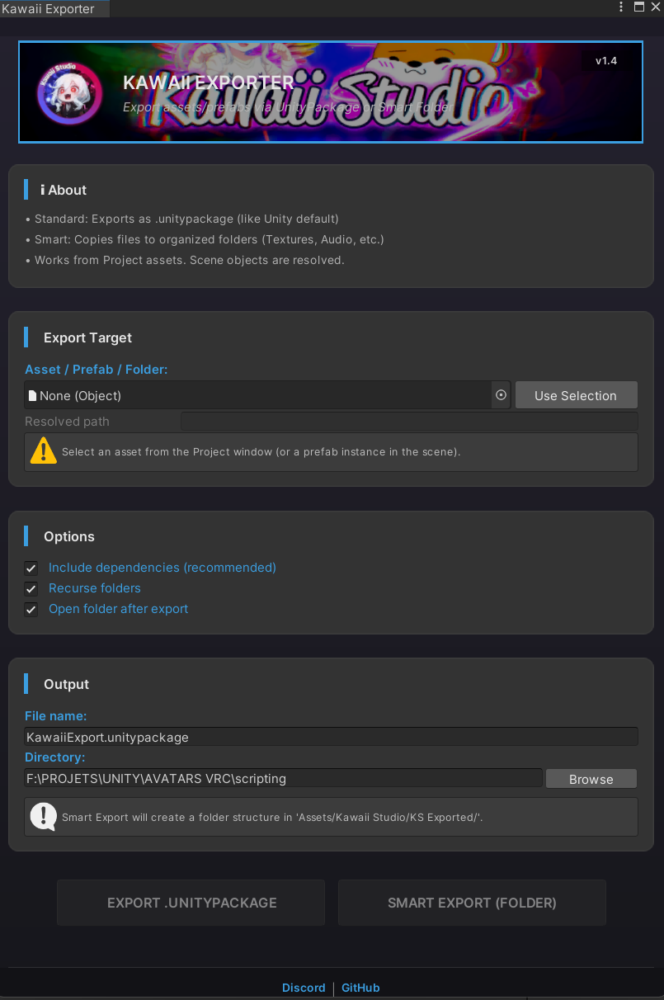
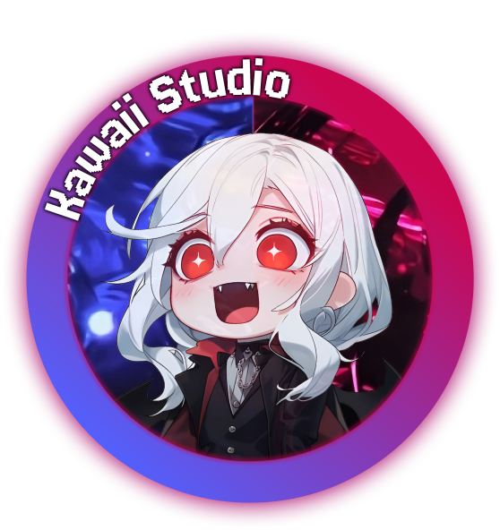



# KS Unity Tools

### Professional VRChat Avatar & Content Creation Suite

**A complete toolkit for optimizing, converting, securing and exporting VRChat avatars — all from within Unity.**

## ⬇️ Install in one click

[Features](#-features) · [Install](#-installation) · [Usage](#-usage) · [Security](#-security) · [Contributing](#-contributing)

## Features

---

### Studio Manager
> Central hub for all Kawaii Studio tools — install, update, and launch everything from one window.

- One-click update from GitHub Releases (auto-backup + rollback on failure)
- Overview of installed tools & shaders with version tracking
- Quick-launch buttons for every tool
- 7 languages: English, Français, Deutsch, Español, Русский, 中文, 日本語

---

### Prefab Optimizer
> Reduce avatar file size by 50-80% while maintaining visual quality.

- **Textures** — Max size control (32-8192), DXT1/DXT5 Crunch compression, mipmap toggle
- **Meshes** — FBX mesh compression (Low/Medium/High) with vertex & polygon optimization
- **Audio** — Vorbis/ADPCM compression, sample rate override, force-to-mono
- Per-asset selection with real-time before/after VRAM comparison
- Progress bar with detailed logging
- Alpha-aware format detection (DXT5/BC3 vs DXT1/BC1)

---

### Video Animator
> Convert videos into lightweight texture atlas animations — no VideoPlayer needed.

- FFMPEG-powered video to texture atlas pipeline
- Built-in **KSVideoDecoder** shader for atlas playback
- Custom frame rate, resolution, time range & atlas size (up to 8192px)
- Auto-generates prefab, material, animation controller & AudioClip
- PNG (Crunch) or JPEG output with quality control
- Organized per-video output folders

---

### GLB to FBX Converter
> Import GLB/GLTF models from Booth, Gumroad, etc. as Unity-ready FBX files.

- Auto-detects Blender from Registry, PATH, Steam & standard install locations
- Principled BSDF → Unity material mapping (BaseColor, Normal, Metallic, Roughness, Emissive)
- Embedded texture extraction to organized `Textures/` subfolder
- Live Blender output streaming in the console

---

### NSFW Detector
> Heuristic content scanner for VRChat avatar compliance.

- Keyword scan (GameObjects, meshes, blendshapes, materials, textures)
- Blendshape pattern matching (hole, penetrate → High flag)
- Skin-tone texture analysis (70% threshold)
- One-click **AUTO-SET**: marks avatar Private + adds `content_sex` / `content_adult` tags
- [Demo video](https://youtu.be/H9snke59njA)

---

### Obfuscator
> Protect your avatar meshes, shaders and hierarchy from ripping.

- Vertex scrambling with configurable distortion strength (2-15)
- Shader encryption & material clipping
- GUID-based name obfuscation
- VRC parameter injection for client-side decryption

---

### Tail Animator to PhysBones
> Convert FImpossible Creations Tail Animator to native VRC PhysBones.

- Play Mode bone capture (position + rotation baking)
- Presets: Soft / Medium / Stiff tails
- Auto-detection of tail animators in the hierarchy
- Loop blending & PhysBone parameter tuning (Pull, Spring, Stiffness, Gravity, Immobile)

---

### Exporter
> Smart .unitypackage export with dependency resolution.

- Standard export or **organized export** (sorted into Textures, Materials, Models, Audio, Animations, Shaders, Prefabs)
- Full dependency collection and validation
- Post-export folder reveal

---

### Ultimate Constraint Tool
> Copy and remap constraints between avatars — including VRC SDK variants.

- Supports ParentConstraint, PositionConstraint, RotationConstraint, ScaleConstraint, LookAtConstraint, AimConstraint
- VRC SDK variants: VRCParentConstraint, VRCRotationConstraint, etc.
- Smart bone mapping: path-based → name-based fallback

---

### Contact Scanner
> List and navigate to all VRCContactReceiver components in your avatar.

- Click-to-select and focus in hierarchy
- Quick overview of all contact points

---

### Custom Shader GUIs
Polished inspector interfaces for included shaders:
- **Vampire Eye** — Pupil smoke, sparkles, hue animation, parallax, rings
- **Blood Killer** — Flow, distortion, doppelganger noise, micro waves, edge opacity
- **Hair Realistic** — Dual anisotropy, blood/liquid layer, rim light, backlight translucency
- **Screen Line** — Minimal shader with community footer
- **KSVideoDecoder** — Texture atlas video playback shader

---

## Security

Every release is scanned on VirusTotal before publishing.

### v2.0 — ✅ 0/72 Clean

| | |
|---|---|
| **SHA-256** | `1816c33d5fe32d5a97ed8aa10e514123266528f904b324d93f6ffa0da012dfe4` |
| **Detections** | **0 / 72** antivirus engines |
| **Status** | No threats detected |

[View full VirusTotal report](https://www.virustotal.com/gui/file/1816c33d5fe32d5a97ed8aa10e514123266528f904b324d93f6ffa0da012dfe4?nocache=1)

Scan details (v2.0)

| Scanner | Result |
|---------|--------|
| Kaspersky | Clean |
| McAfee | Clean |
| Avast | Clean |
| BitDefender | Clean |
| Symantec | Clean |
| Microsoft | Clean |
| ESET-NOD32 | Clean |
| Sophos | Clean |
| CrowdStrike | Clean |
| TrendMicro | Clean |
| **Total** | **0/72 detections** |

### v1.x — ✅ 0/73 Clean

| | |
|---|---|
| **SHA-256** | `9188186f829ce5ac52f2c758eeb553a8dc39b627ba53ea165e536afa558ec73e` |
| **Detections** | **0 / 73** antivirus engines |
| **Status** | No threats detected |

[View full VirusTotal report](https://www.virustotal.com/gui/file/9188186f829ce5ac52f2c758eeb553a8dc39b627ba53ea165e536afa558ec73e?nocache=1)

Scan details (v1.x)

| Scanner | Result |
|---------|--------|
| Kaspersky | Clean |
| McAfee | Clean |
| Avast | Clean |
| BitDefender | Clean |
| Norton | Clean |
| Windows Defender | Clean |
| **Total** | **0/73 detections** |

---

## Installation

### Method 1 — VRChat Creator Companion (Recommended)

**Click the button** — VCC opens and adds the Kawaii Studio listing on its own. Then open
your project in VCC, find **KS Unity Tools** in the package list and hit **Add**.

Updates then show up in VCC automatically: every new release is published to the listing,
so the package just offers an **Update** button. Nothing to download by hand.

> The button can't be a raw `vcc://` link — GitHub strips those from READMEs — so it points
> at a tiny page that hands off to VCC the instant it loads. If your browser asks first,
> confirm the "Open VRChat Creator Companion" prompt.
>
> Prefer to add it by hand? In VCC → Settings → Packages → Add Repository, paste:
> `https://kawaiistudio.github.io/KSUnityTools/index.json`

### Method 2 — .unitypackage (no VCC needed)

**[➜ Download KSUnityTools.unitypackage](https://github.com/kawaiistudio/KSUnityTools/releases/latest/download/KSUnityTools.unitypackage)**

Double-click it with your project open and import. Everything installs under
`Assets/Kawaii Studio`. The VRChat-specific tools activate on their own when the VRChat
SDK is present, and stay out of the way when it isn't — so the package is safe to import
into any project.

### Method 3 — Unity Package Manager (git URL)
1. `Window > Package Manager` then `+` then **Add package from git URL**
2. Paste: `https://github.com/kawaiistudio/KSUnityTools.git`

---

## Usage

| Tool | Menu Path |
|------|-----------|
| Studio Manager | `Kawaii Studio > Studio Manager` |
| Prefab Optimizer | `Kawaii Studio > Universal Tools > Prefab Optimizer` |
| Video Animator | `Kawaii Studio > Universal Tools > Video Animator` |
| GLB to FBX | `Kawaii Studio > Universal Tools > GLB to FBX` |
| Exporter | `Kawaii Studio > Universal Tools > Exporter` |
| NSFW Detector | `Kawaii Studio > VRC > NSFW Detector` |
| Obfuscator | `Kawaii Studio > VRC > Obfuscator` |
| Tail → PhysBones | `Kawaii Studio > VRC > Tail Animator to PhysBones` |
| Constraint Tool | `Kawaii Studio > VRC > Ultimate Constraint Tool` |
| Contact Scanner | `Kawaii Studio > Contact Scanner Window` |

### Quick Start — Prefab Optimizer
1. Open `Kawaii Studio > Universal Tools > Prefab Optimizer`
2. Drag your avatar into the **TARGET PREFAB** slot
3. Click **SCAN PREFAB**
4. Adjust texture/mesh/audio settings
5. Select/deselect individual assets
6. Click **OPTIMIZE**
7. Review the before/after stats and test in VRChat

---

## Requirements

| Component | Minimum |
|-----------|---------|
| Unity | 2019.4+ |
| VRChat SDK | 3.0+ |
| Blender | 2.8+ *(GLB Converter only)* |
| FFMPEG | Any recent version *(Video Animator only)* |
| OS | Windows / macOS / Linux |

---

## Changelog

### v2.0 *(Current)*
- Video Animator with texture atlas generation
- Studio Manager hub (Tools/Shaders + quick launch + GitHub updater)
- Audio compression optimizer (Vorbis/ADPCM + quality + sample rate)
- Prefab Optimizer: progress bar, cached GUIStyles, alpha-aware format detection, fixed log scroll
- UI consistency pass across all tools
- Enhanced VRAM tracking

### v1.1
- Post-optimization size estimates
- Purple/red/green theme
- Runtime VRAM calculations
- UI layout fixes

### v1.0
- Initial release: Texture optimizer, GLB to FBX converter, mesh compression, logging

---

## Contributing

- [Report bugs](https://github.com/kawaiistudio/KSUnityTools/issues)
- Suggest features via Issues
- Submit pull requests
- Star the repo if you find it useful!

---

## License

**MIT License** — free to use, modify, and distribute. See [LICENSE](LICENSE).

---

### Made with love by **Kawaii Studio**

*Professional tools for VRChat creators*

[GitHub](https://github.com/kawaiistudio) · [Ko-fi](https://ko-fi.com/vrchatarchive) · [VRChat Group](https://vrchat.com/home/group/grp_7bf987ee-2f4a-4eae-b9b5-c060b97250ab) · [Discord](https://discord.gg/xAeJrSAgqG) · [Telegram](https://t.me/kawaiistudio)

